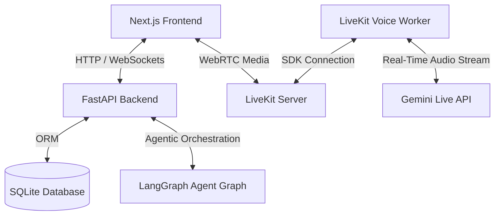
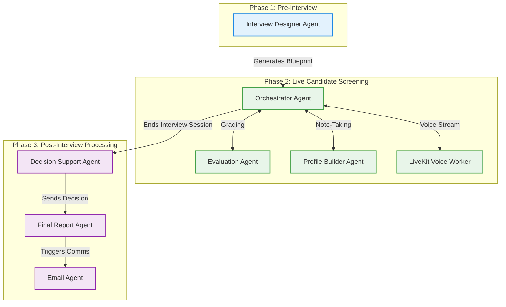

# 🚀 1 Min Scout: Autonomous AI Interview Agent Platform

An immersive **Autonomous AI Interview Agent & Designer Platform** built to streamline candidate screening. By combining multi-agent AI orchestration, low-latency WebRTC live voice streaming, and an interactive prompt-to-blueprint designer workspace, the platform provides end-to-end recruitment automation.

---

## 🌟 Key Features

### 1. 🛠️ Interview Designer Workspace
*   **Prompt-to-Blueprint compiler**: Describe the role and rubric in natural language (e.g., *"Make an interview for a Junior Frontend Developer role focusing on React and communication"*), and let the AI generate the JSON structure.
*   **Zustand Sync state management**: Visual tab editors dynamically modify program metadata, candidate target profiles, competencies, skill matrices, structured section durations, scoring weights, evaluation rubrics, and automated decision-making rules.
*   **SQLite Blueprint persistence**: Publish/revert configurations directly to the database with a single click.

### 2. 🗣️ Immersive Live Voice Screening (LiveKit WebRTC)
*   **Ultra-low latency audio**: Full-duplex voice communication utilizing WebRTC via LiveKit Server.
*   **Google Gemini Live API**: Runs the state-of-the-art voice model (`gemini-3.1-flash-live-preview`) to conduct highly conversational, adaptive interviews.
*   **Real-time Collapsible Debugger**: View internal agent reasoning logs, target evaluation categories, confidence meters, transcript evidence quotes, and real-time candidate strengths/weaknesses side-by-side with the call.

### 3. 💬 Dynamic Text Screening Room
*   **LangGraph Multi-Agent Flow**: Dynamic orchestration using LangGraph to guide the candidate through the interview section by section.
*   **Adaptive Follow-Ups**: Dynamically drills down into candidate answers to extract concrete evidence for rubrics.
*   **Embeddings-driven RAG Retrieval**: Uses Google `text-embedding-004` to match candidate responses semantically to database requirements.

### 4. 📊 Admissions Board & Analytics
*   **Admin Dashboard**: View candidate screening logs, overall matching scores, status filters, and detailed score cards.
*   **Evaluation Summaries**: Review detailed, AI-generated candidate profiles detailing requirement checkmarks, core competencies score breakdowns, and hire/review/reject verdicts.
*   **Automated Email feedback**: Send templates and score cards directly to candidates using secure SMTP.

---

## 🛠️ Architecture & Tech Stack


# Comprehensive Agent & Sub-Agent Overview

This document provides a complete breakdown of all the primary agents and sub-agents operating within the 1 Min Scout platform. They are logically grouped by the three main phases of the pipeline.

### System Architecture Visual

---

### Frontend
*   **Next.js (Pages router)**
*   **TailwindCSS & Vanilla CSS styling**
*   **Zustand** (Local store state management)
*   **Lucide React** (Modern glassmorphic icon sets)
*   **LiveKit React Components** (WebRTC interface)

### Backend
*   **FastAPI & Uvicorn**
*   **LangGraph** (Stateful multi-agent system execution)
*   **SQLAlchemy** (SQLite database interactions)
*   **Google GenAI SDK** (Embeddings & Compiler utilities)
*   **LiveKit Agents SDK** (Voice agent runner)

---

## 🚀 Quick Start (Windows Setup)

### Prerequisites
*   **Python 3.10+**
*   **Node.js 18+**
*   **Docker Desktop** (To run the LiveKit server container)

### 1. Automatic Setup (Recommended)
If you don't have the dependencies installed, or want an automatic setup, run the new `setup.py` script:
```powershell
python setup.py
```
This script will:
- Check for Python and Node.js
- Create a virtual environment `.venv`
- Install Python dependencies for the backend
- Install Node.js dependencies for the frontend

### 2. Configure Environments
Create a file named `.env` inside the `backend/` directory:
```env
GEMINI_API_KEY=your_gemini_api_key
GOOGLE_API_KEY=your_gemini_api_key
LIVEKIT_URL=ws://localhost:7880
LIVEKIT_API_KEY=devkey
LIVEKIT_API_SECRET=secret

# Optional Email SMTP Settings
SMTP_HOST=smtp.gmail.com
SMTP_PORT=587
SMTP_USER=your_email@gmail.com
SMTP_PASSWORD=your_app_password
SMTP_FROM=your_email@gmail.com
```

### 3. Startup using the Launcher
Double-click the **[run.bat](./run.bat)** script in the root directory. 

This batch file bypasses PowerShell execution policies and launches all 4 modules in separate windows:
1.  **LiveKit Server Container** (Docker) on port `7880`
2.  **FastAPI Backend** Server on `http://localhost:8000`
3.  **Next.js Frontend** Dev Server on `http://localhost:3000`
4.  **LiveKit Voice Agent Worker** (listening for voice sessions)

---

## 🧪 Running Tests
The FastAPI backend contains unit tests for the agent state graph and endpoints. To run them:
1. Open a PowerShell terminal.
2. Activate your virtual environment: `.\.venv\Scripts\activate.ps1`
3. Run pytest:
```powershell
python -m pytest backend/tests
```

---

## 📄 License
This project is proprietary and custom-tailored for agentic recruitment evaluations. All rights reserved.
