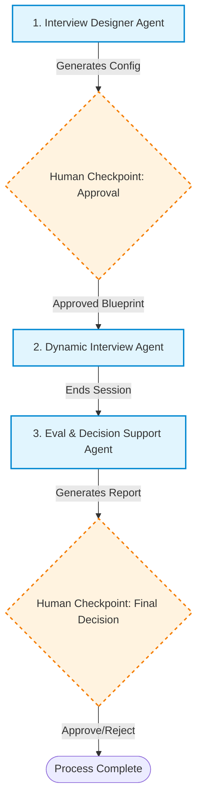
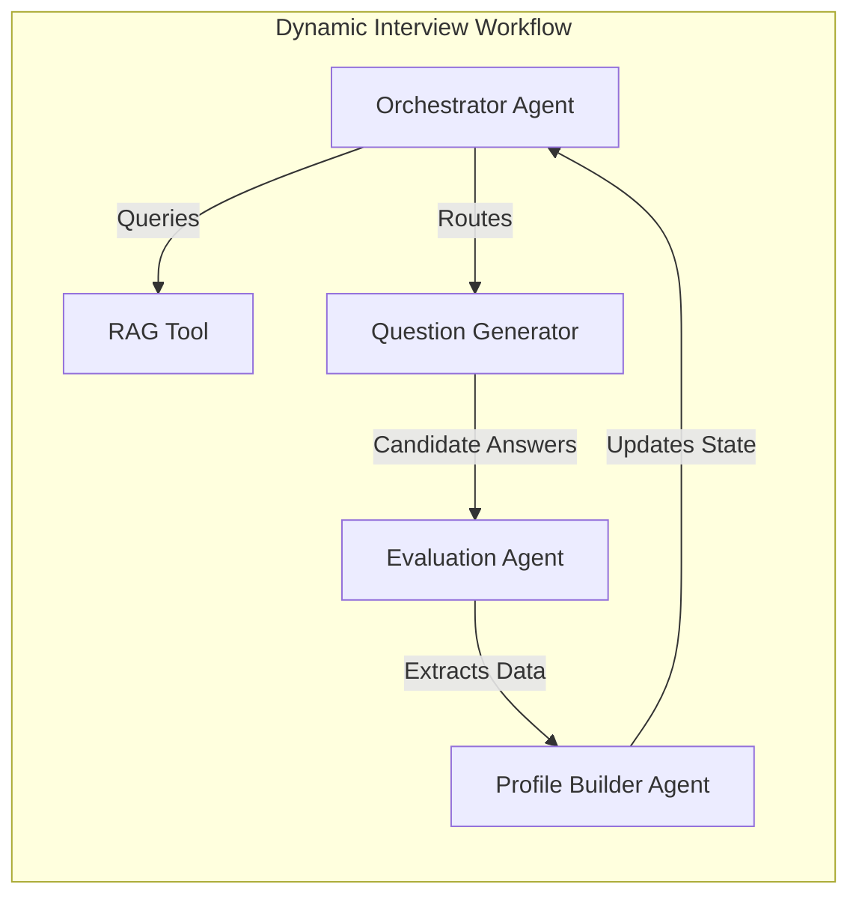

# Multi-Stage Agentic Workflow: 1 Min Scout

This document outlines the core agentic architecture of the platform. By transitioning from a monolithic conversational bot into a structured **Multi-Stage Agentic System with Human Checkpoints**, the platform achieves enterprise-level reliability, safety, and operational transparency.

---

## The Core Pipeline

The system is designed around three primary agentic phases, interspersed with mandatory human-in-the-loop (HITL) checkpoints. 

---

## 1. Interview Designer Agent

> [!NOTE]
> **Purpose**: Translates natural language intent into a strictly structured machine configuration.

This agent operates in the pre-interview phase to help the recruiter or administrator create the interview blueprint. Instead of filling out complex UI forms, the admin describes the role, required skills, grading rubric, duration, and decision rules in natural language. The system compiles that intent into a highly structured JSON blueprint configuration.

> [!WARNING]
> **Human-in-the-Loop Checkpoint: Blueprint Approval**
> Before any interview goes live, a human reviewer/admin checks the generated blueprint, edits the parameters (weights, thresholds, competencies) if necessary, and manually **publishes** it to the database.

---

## 2. Dynamic Interview Agent

> [!TIP]
> **Purpose**: Conducts the live screening using the approved blueprint, continuously looping through observation, reasoning, and planning.

This is the candidate-facing agent. It conducts the interview dynamically based on the active blueprint. It seamlessly supports two modalities:
*   **Text Interview Mode**: An interactive chat room.
*   **Live Voice Interview Mode**: Full-duplex, low-latency voice communication utilizing LiveKit and Google Gemini Live.

Rather than acting as a simple stateless chatbot, this stage relies on a complex orchestration of **Sub-Agents** to navigate the conversation logically:

### Sub-Agent Breakdown:
*   **Orchestrator Agent**: The central state manager. It observes the interview state and decides the next strategic move (e.g., pivot to a new skill, drill down for more detail, or end the interview).
*   **Evaluation Agent**: Analyzes each of the candidate's answers in real-time to determine if the rubric requirements are being met.
*   **Profile Builder Agent**: Extracts concrete candidate information from the conversation and updates the session's long-term memory.
*   **Question Generator Agent**: Crafts the next adaptive, natural-sounding question based on the orchestrator's chosen target.
*   **RAG Tool**: Retrieves necessary rubrics, skill definitions, and context from the vector database.

---

## 3. Evaluation and Decision Support Agent

> [!NOTE]
> **Purpose**: Synthesizes scattered evaluation data into a concrete, actionable candidate report.

Once the interview concludes, the system processes all session data to generate a highly structured candidate report. This report is comprehensive, combining the extracted profile, technical scores, identified strengths and weaknesses, transcript evidence, and an automated recommendation.

### Stage Components:
*   **Scoring Tool**: Computes the final grade against the blueprint thresholds.
*   **Decision Support Agent**: Recommends a final action (e.g., Hire, Reject, Review) based on the rule logic defined in the blueprint.
*   **Final Report Agent**: Synthesizes the raw conversation logs into a readable, concise summary.
*   **Reporting Layer**: Renders the output onto the Recruiter Dashboard UI.
*   **Feedback Support**: Optionally generates automated email templates to send back to the candidate.

> [!IMPORTANT]
> **Human-in-the-Loop Checkpoint: Final Decision**
> The AI does not make the final hiring choice. A human evaluator reviews the generated dashboard report, inspects the transcript evidence, and makes the final decision to approve, reject, or further review the candidate.
