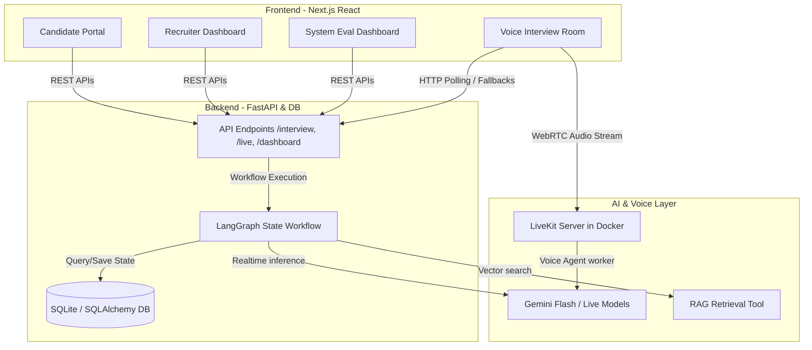

# Autonomous AI Interview Agent Platform — Capstone Project Report

This report outlines the design, architecture, and visual layout of the **Autonomous Interview Agent Platform** (1 Min Scout). It serves as a comprehensive reference for the capstone project.

---

## 🧠 Agentic AI Design

### Why This is More Than a Chatbot
Conventional chatbots operate on a simple **reactive** model: they receive a user text prompt, process it through a static pipeline, and output a response without maintaining long-term memory, planning capacity, or validation feedback loops. 

In contrast, the **Autonomous AI Interview Agent** is a stateful agentic system. It possesses:
1. **Dynamic Goal Tracking**: It follows a structured admissions rubric (checking 13 specific profile categories) rather than a linear script.
2. **Context-Aware Decisions**: It continuously assesses which profile requirements are satisfied, weak, or missing, deciding on-the-fly what topic to explore next.
3. **Structured Evaluation & Guardrails**: Every turn is run through security validators (jailbreak/prompt injection checks), relevance scorers, and profile extractor models to update a persistent database state.
4. **Multimodal Capabilities**: It supports both textual chat interfaces and real-time WebRTC voice streams with low-latency Gemini Live models.

---

### The Agentic Loop: Chatbot vs. Agentic Workflow

```mermaid
graph TD
    subgraph Simple Chatbot Flow
        U[User Message] --> LLM[LLM Generation] --> O[Raw Output Response]
    end
    
    subgraph Agentic Loop (1 Min Scout)
        O1[Observe: Read state & database context] --> R1[Reason: Check security, parse input, evaluate content]
        R1 --> P1[Plan: Determine missing criteria & update target requirements]
        P1 --> A1[Act: Generate tailored question or close interview]
        A1 --> E1[Evaluate: Check accuracy, update evidence map & scores]
        E1 --> O1
    end
```

#### Detailed Loop Execution Phases:
*   **Observe**: The system reads the `InterviewState` payload (turn count, messages, profile status, and existing evidence).
*   **Reason**: Inputs are validated against security metrics and relevance scores. The model analyzes the candidate's last answer to identify alignment with specific skills (e.g., Python, RAG, Machine Learning).
*   **Plan**: The orchestrator updates the list of remaining target requirements and determines the next action (e.g., continue current requirement, pivot to a new skill, wrap up).
*   **Act**: The text or voice assistant delivers the next target question, customized dynamically based on the candidate's background.
*   **Evaluate**: Answers are saved to database logs; scores, strengths, and weaknesses are calculated and mapped.

---

### Core Sub-Agents
The platform's cognitive architecture is split into five specialized sub-agents working together in a LangGraph workflow:

1. **Orchestrator Agent**: The decision-maker. It updates the `evidence_map` showing which categories are "satisfied", "weak", or "missing", selecting the most critical topic for the next turn.
2. **Interview/Question Generation Agent**: The interlocutor. Formulates natural, conversational questions tailored to the candidate's experience, matching the selected topic.
3. **Evaluation Agent**: The validator. Runs post-turn grading on candidate responses, scoring technical proficiency, communication skills, and answer relevance.
4. **Profile Builder Agent**: The parser. Extract details from candidate responses to build a structured JSON profile containing their education, projects, skills, and background.
5. **Final Report Agent**: The summary builder. When the interview finishes, it synthesizes all conversation records, computes scores, and generates a structured final report with recommendation decisions.

---

## 🏗️ System Architecture

The platform is designed with a modern decoupled layout, linking an interactive React client to a Python/LangGraph backend over fast REST APIs and WebRTC streams.



### Architectural Breakdown:
*   **Frontend (Next.js & React)**: Uses Tailwind CSS for styles, Lucide icons, and `@livekit/components-react` hooks (specifically `useTrackToggle` and `useVoiceAssistant`) to control low-latency WebRTC streams.
*   **Backend (FastAPI)**: Serves REST endpoints for authentication, state management, recruiter administration, and live token generation. Maintains session states using a SQLite database mapped with SQLAlchemy models.
*   **AI Layer (Gemini & LangGraph)**: LangGraph handles complex state machine transitions. RAG utilities are used to query knowledge bases. Gemini models are queried for evaluations, text generations, and real-time voice streaming.
*   **Data Layer (SQLAlchemy)**: Stores entities including `User`, `CandidateProfile`, `LiveSession`, and `InterviewLog` to persist credentials, transcripts, and evaluation results.

---

## 🖼️ Visual Platform Tour (Screenshots)

Below are the high-resolution screenshots captured from the active platform:

### 1. Landing Page
The entry point of the platform, outlining candidate steps and setup requirements.


---

### 2. Login Portal
Seeded credentials allow instant logins for candidate rooms and admin dashboards.


---

### 3. Text-based Candidate Interview Room
Adaptive text-based chat interface displaying target progress, profile completeness, and the AI agent's questions.


---

### 4. Real-time Voice Interview Room
WebRTC voice room with active audio visualization, custom voice configurations, microphone mute toggles, and live transcript sync.


---

### 5. Recruiter Dashboard
Recruiter tracking board showing candidate lists, overall test scores, and recommendations.


---

### 6. Detailed Candidate Evaluation Report
In-depth profile builder report showing extracted candidate metadata, categorized strengths/weaknesses, and detailed log scores for each turn.


---

### 7. System Evaluation Metrics Page
Analytics page displaying agent performance logs, response times, token metrics, and grading charts.

