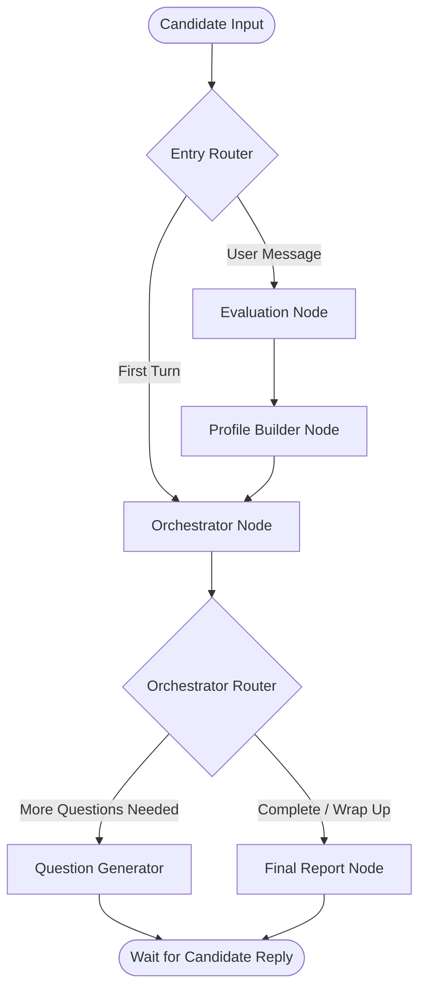
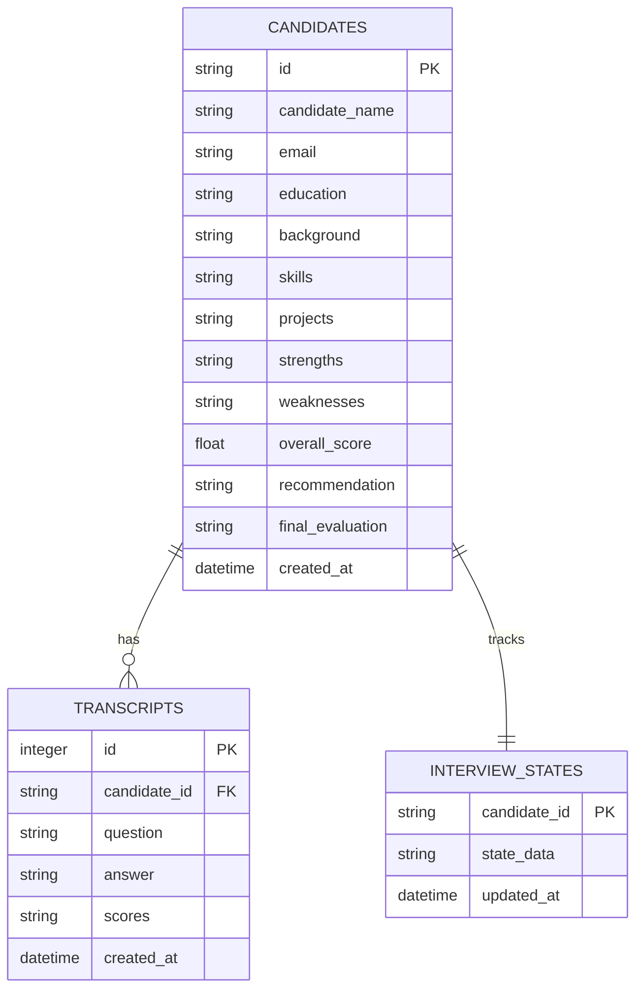

# Notion: AI Interview Agent Documentation

## 00 Blueprint

The **1-Min Recruiter AI Interview Agent** is an autonomous, adaptive screening system designed for software development bootcamps. Instead of a rigid, linear question list, this agent operates as an **evidence-based admissions interviewer**. 

It uses a stateful conversation graph to dynamically probe candidates, grade their technical depth in real-time, extract relevant profile details, update a criteria-based completeness checklist, and compile a final readiness scorecard.



---

## 01 Requirements

The agent guides the conversation toward validating **9 required admissions criteria** defined by the admissions policy:

| Requirement | Focus Area | Success Criteria |
| :--- | :--- | :--- |
| **motivation/background** | Background | Clear explanation of career change drive and bootcamp goals. |
| **education** | Background | Previous academic history or self-study background. |
| **time commitment** | Background | Availability to commit 40+ hours/week to the program. |
| **core coding knowledge** | Skills | Basic programming logic, loops, functions, variables. |
| **web basics** | Skills | Basic understanding of HTML, CSS, client-server models. |
| **database fundamentals**| Technical | Basic knowledge of tables, relational data, and keys. |
| **project experience** | Projects | Any coding work or scripts the candidate has built. |
| **problem-solving mindset**| Technical | How the candidate articulates logic, trade-offs, and debugs. |
| **communication quality** | Passive | Clarity, vocabulary, structure, and professional tone (scored passively). |

---

## 02 Architecture

The system is powered by a **LangGraph state machine** and a FastAPI backend. 

### Conversation State (`InterviewState`)
State variables passed between nodes include:
*   `messages`: Complete chat history.
*   `current_profile_data`: Extracted candidate parameters.
*   `evidence_map`: Real-time validation status of the 9 criteria.
*   `next_action`: High-level step (`ask_first_question`, `ask_follow_up`, `switch_topic`, `wrap_up`, `complete`).
*   `target_requirement`: The current focus requirement.
*   `turn_count` & `max_turns` (capped at 12): Length budget.
*   `orchestration_strategy`: Strategy selector (`config` or `prompt`).

### Node Transition Pipeline
1.  **Entry Router**: Checks if `answer_history` is empty. If empty, routes straight to the Orchestrator (generating the initial question). Otherwise, routes to **Evaluation**.
2.  **Evaluation Node**: Grades the candidate's last response using RAG-retrieved rubrics.
3.  **Profile Builder Node**: Parses and updates candidate facts (saves details to DB).
4.  **Orchestrator Node**: Inspects the updated state to decide the next action and target topic (calls either config or prompt engine).
5.  **Orchestrator Router**: If wrapping up, routes to the **Final Report Node**. Otherwise, routes to the **Question Generator Node** to formulate the next query.

---

## 03 Agent Design

### Evaluation Agent
*   **Model**: `gemini-3.1-flash-lite`
*   **Role**: Technical grading. It pulls rubrics from RAG database, scores answers on a 1-5 scale (accuracy, depth, clarity, relevance), and logs strengths/weaknesses.

### Profile Builder Agent
*   **Model**: `gemini-3.1-flash-lite`
*   **Role**: Entity extraction. Parses text for education background, time commitment availability, skills, and projects, saving them as structured JSON.

### Orchestrator Agents (Dual Strategy)
*   **Config-Based (`InterviewOrchestratorAgent`)**: Hardcoded Python rules. Checks if the criteria strings/conditions are met in state. Targets the next missing checklist item. If the last response scored `< 3.0`, it enforces a one-turn follow-up probe.
*   **Prompt-Based (`LLMOrchestratorAgent`)**: Fully LLM-driven via `gemini-3.1-flash-lite`. Evaluates the transcript semantically. Moves through checklist items organically.

### Final Report Agent
*   **Model**: `gemini-3.1-flash-lite`
*   **Role**: Compiles final readiness scorecards, qualitative assessment summaries, and generates a binary recommendation (`Yes` / `No`).

### Question Generator Tool
*   **Model**: `gemini-3.1-flash-lite`
*   **Role**: Wording engine. Generates natural, context-aware screening questions mapped to the current `target_requirement` and prevents generating similar/duplicate questions.

---

## 04 Database Design

The local database uses **SQLite** (managed via SQLAlchemy).



---

## 05 API Design

### 1. Start Session
*   **Endpoint**: `POST /interview/start`
*   **Payload**:
    ```json
    {
      "name": "Jane Doe",
      "email": "jane@example.com",
      "orchestration_strategy": "prompt" 
    }
    ```
*   **Response**:
    ```json
    {
      "candidate_id": "84a7e3d1-fb6d-4952-ba64-5bf2bfae498c",
      "question": "Welcome Jane! What motivated you to apply to our bootcamp?"
    }
    ```

### 2. Message Loop
*   **Endpoint**: `POST /interview/message`
*   **Payload**:
    ```json
    {
      "candidate_id": "84a7e3d1-fb6d-4952-ba64-5bf2bfae498c",
      "message": "I want to pivot my career from sales to engineering."
    }
    ```
*   **Response**:
    ```json
    {
      "response": "That is an interesting transition. What kind of coding experience do you have?",
      "profile_completion_percentage": 25,
      "interview_phase": "BACKGROUND",
      "interview_status": "active"
    }
    ```

### 3. Retrieve Candidate Profile
*   **Endpoint**: `GET /interview/profile/{candidate_id}`
*   **Response**: Returns final dossier, extracted JSON fields, overall scores, and admission assessment recommendations.

---

## 06 Task Board

### Completed Achievements
*   [x] **Model Upgrade**: Upgraded all GenAI client operations to the modern `gemini-3.1-flash-lite` model.
*   [x] **Evidence policy**: Migrated rigid linear phase routing into the 9-point criteria evidence mapping.
*   [x] **State Extension**: Added `evidence_map`, `next_action`, and turn counters to the database and API payloads.
*   [x] **Dual Orchestrator Routing**: Developed the LLM-driven `LLMOrchestratorAgent` and implemented dynamic routing inside `interview_graph.py`.
*   [x] **UI Strategy Toggle**: Added selector buttons to the frontend interview portal to switch strategies.
*   [x] **Dependency Resolution**: Switched next configuration to `.mjs` and installed native swc binaries to fix environment lookup errors.
*   [x] **Test suite**: Added automated coverage with mock fallback checks totaling 14 passing tests.

---

## 07 Decisions

### ADR 01: Config-First Admissions Policy
*   **Context**: The team wanted an evidence-based system but needed debuggability.
*   **Decision**: Implemented the core checklist as strict typed Python structures first. This enables writing deterministic tests to make sure the state machine handles edges (like low scores or turn limits) properly.

### ADR 02: Dual Strategy Toggle
*   **Context**: Testing LLM-driven transitions vs rules.
*   **Decision**: Added a toggle option. This allows us to compare conversational fluidity (Prompt-based) directly against predictability and latency metrics (Config-based) on the exact same UI screen.

### ADR 03: Native next.config.mjs
*   **Context**: Node module resolution conflicts on machines running parent projects.
*   **Decision**: Converted `.ts` next configs to `.mjs` format. This resolved parent/child version lookups, ensuring Next.js starts up correctly on all environments.
