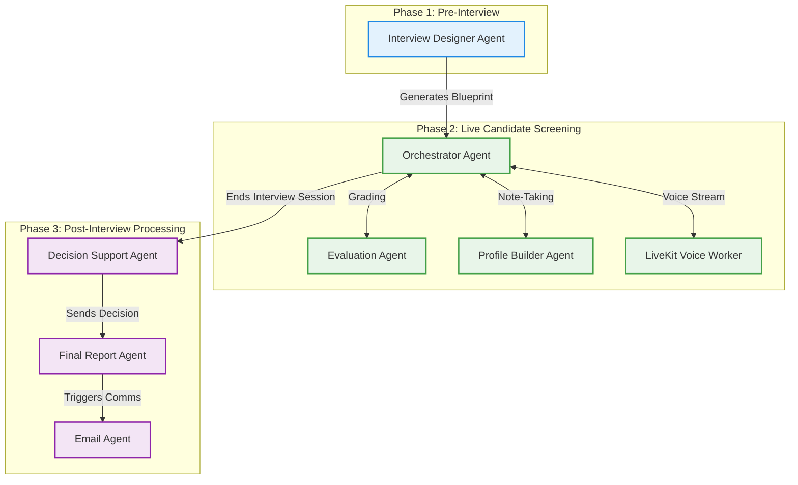

# Comprehensive Agent & Sub-Agent Overview

This document provides a complete breakdown of all the primary agents and sub-agents operating within the 1 Min Scout platform. They are logically grouped by the three main phases of the pipeline.

### System Architecture Visual

---

## ⚙️ Phase 1: Pre-Interview

### 1. Interview Designer Agent
> [!NOTE]  
> **Role**: The "Architect"

*   **Function**: Translates the admin's natural language descriptions (e.g., "Build a junior React developer interview") into the structured JSON blueprint used by the rest of the system.
*   **Location**: Driven by the `POST /api/blueprint/chat` endpoint running Google's Flash models to compile the configuration.

---

## 🎤 Phase 2: Live Candidate Screening (Dynamic Interview Agent)

This is the main LangGraph state machine running the interview. It relies on several specialized **Sub-Agents** to function logically:

### 1. Orchestrator Agent
> [!TIP]  
> **Role**: The "Brain"

*   **Function**: Looks at the blueprint and the conversation history, then decides what topic to drill into next, or when to end the interview.
*   **Location**: `backend/agents/llm_orchestrator_agent.py` and `backend/agents/interview_orchestrator_agent.py`

### 2. Evaluation Agent
> [!TIP]  
> **Role**: The "Grader"

*   **Function**: After every candidate answer, this agent checks it against the rubric, calculating real-time scores and extracting strengths/weaknesses.
*   **Location**: `backend/agents/evaluation_agent.py`

### 3. Profile Builder Agent
> [!TIP]  
> **Role**: The "Note-Taker"

*   **Function**: Listens to the candidate's answers and incrementally extracts their skills, education, and work history into a clean JSON data structure in the background.
*   **Location**: `backend/agents/profile_builder_agent.py`

### 4. LiveKit Voice Worker *(Optional Voice Extension)*
> [!TIP]  
> **Role**: The "Ears & Mouth"

*   **Function**: Specifically handles the low-latency WebRTC audio stream, connecting the candidate's microphone directly to the `gemini-3.1-flash-live-preview` model.
*   **Location**: `backend/livekit_agent.py`

---

## 📊 Phase 3: Post-Interview Processing (Eval & Decision Support)

Once the candidate completes the interview, the system hands off the data to this final team of sub-agents:

### 1. Decision Support Agent
> [!IMPORTANT]  
> **Role**: The "Judge"

*   **Function**: Takes the final scores and compares them against the passing thresholds defined in your blueprint, ultimately recommending an action: **Hire**, **Review**, or **Reject**.
*   **Location**: `backend/agents/decision_support_agent.py`

### 2. Final Report Agent
> [!IMPORTANT]  
> **Role**: The "Synthesizer"

*   **Function**: Takes the massive raw log of the entire conversation and the judge's decision, compressing it into a highly readable, structured summary of the candidate's performance.
*   **Location**: `backend/agents/final_report_agent.py`

### 3. Email Agent
> [!IMPORTANT]  
> **Role**: The "Communicator"

*   **Function**: Takes the final report and decision, writes a polite, personalized follow-up email to the candidate, and sends it automatically via SMTP.
*   **Location**: `backend/agents/email_agent.py`
